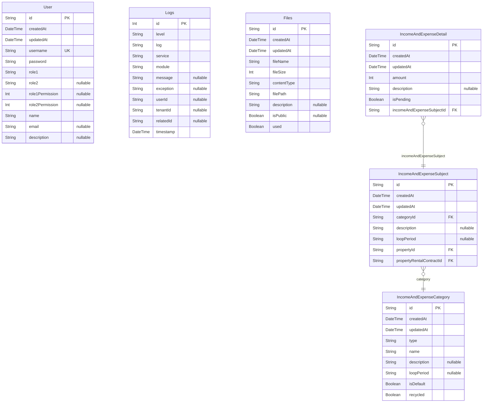
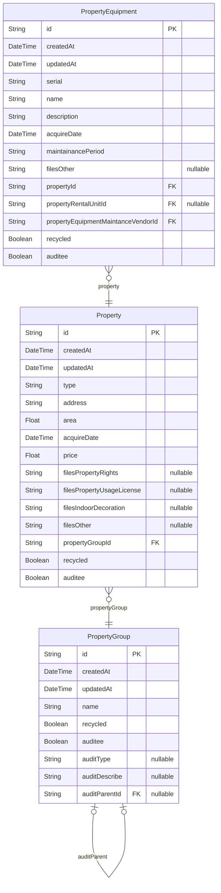
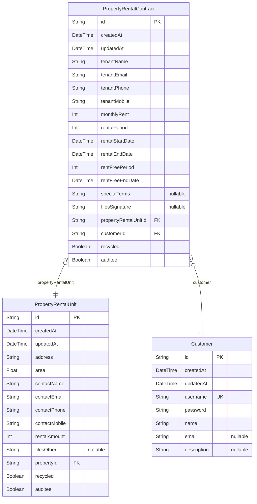
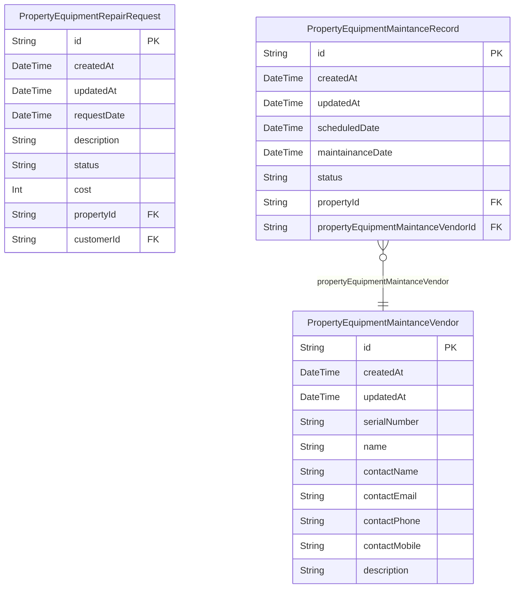

# Prisma Markdown
> Generated by [`prisma-markdown`](https://github.com/samchon/prisma-markdown)

- [系統維護管理作業](#系統維護管理作業)
- [資產管理作業](#資產管理作業)
- [租賃管理作業](#租賃管理作業)
- [設施設備修繕採購作業](#設施設備修繕採購作業)

## 系統維護管理作業

### `User`
管理台銀使用者帳號

所有權限皆可修改自己的密碼
Admin 可以新建/修改/刪除帳號，與提出修改密碼請求

**Properties**
  - `id`: 
  - `createdAt`: 
  - `updatedAt`: 
  - `username`: 使用者名稱
  - `password`: 使用者密碼
  - `role1`: Admin (系統管理者) / Operator (作業人員) / Reviewer (審核人員)
  - `role2`: Admin (系統管理者) / Operator (作業人員) / Reviewer (審核人員)
  - `role1Permission`: 0x00000000. 資產管理作業 / 租賃管理作業 / 設施設備修繕採購作業 / 會計帳務管理作業 / 事務管理作業 / 決策支援及報表作業 / 系統維護管理作業
  - `role2Permission`: 0x00000000. 資產管理作業 / 租賃管理作業 / 設施設備修繕採購作業 / 會計帳務管理作業 / 事務管理作業 / 決策支援及報表作業 / 系統維護管理作業
  - `name`: 真實姓名或法人名稱
  - `email`: Email通知消息時使用
  - `description`: 其他備註

### `Logs`
日誌

**Properties**
  - `id`: 
  - `level`: 
  - `log`: 
  - `service`: 
  - `module`: 
  - `message`: 
  - `exception`: 
  - `userId`: 
  - `tenantId`: 
  - `relatedId`: 
  - `timestamp`: 

### `Files`
上傳檔案

**Properties**
  - `id`: 
  - `createdAt`: 
  - `updatedAt`: 
  - `fileName`: 
  - `fileSize`: 
  - `contentType`: 
  - `filePath`: 檔案存放路徑
  - `description`: 備註
  - `isPublic`: 是否需要權限存取
  - `used`: 關聯資料，回收處理使用 ///

### `IncomeAndExpenseCategory`
收入支出分類

**Properties**
  - `id`: 
  - `createdAt`: 
  - `updatedAt`: 
  - `type`: 收入 (Income) 或支出 (Expense)
  - `name`: 收支類別名稱，例如: 電費
  - `description`: 收支類別詳細說明
  - `loopPeriod`: 循環週期。格式: Linux Crontab Syntax
  - `isDefault`: 是否為出廠預設類別
  - `recycled`: 是否回收 (D)

### `IncomeAndExpenseSubject`
在資產或出租合約中，實際代表可收支項目

**Properties**
  - `id`: 
  - `createdAt`: 
  - `updatedAt`: 
  - `categoryId`: 關連到哪一個 收支項目類別
  - `description`: 額外詳細說明
  - `loopPeriod`: 覆蓋循環週期。格式: Linux Crontab Syntax
  - `propertyId`: 屬於哪個資產
  - `propertyRentalContractId`: 屬於哪個資產出租合約

### `IncomeAndExpenseDetail`
代表一期帳單支付，或收入入帳

**Properties**
  - `id`: 
  - `createdAt`: 
  - `updatedAt`: 
  - `amount`: 金額。單位: 新台幣
  - `description`: 額外詳細說明
  - `isPending`: 自動建立後，即進入待處理狀態。直至填寫完畢
  - `incomeAndExpenseSubjectId`: 屬於哪個收支項目主體

## 資產管理作業

### `PropertyGroup`
資產群組

可作為受審核主體
審核過程存入Logs
審核過程與紀錄
1: 提交審核: userId (提交人) / tenantId (PropertyGroupId) / relatedId
2: 接受或駁回審核: userId (提交人) / tenantId (PropertyGroupId) / relatedId (審核人) / message (接受或駁回訊息)

**Properties**
  - `id`: 
  - `createdAt`: 
  - `updatedAt`: 
  - `name`: 資產群組名稱。例: 葉財記大樓
  - `recycled`: 資料已被刪除、或審核完成
  - `auditee`: 是否為審核相關資料
  - `auditType`: 審核類別: 新增 / 修改 / 刪除
  - `auditDescribe`: 描述修改內容: 用來提示審核員，我修改了什麼?
  - `auditParentId`: 審核資料父層

### `Property`
資產

**Properties**
  - `id`: 
  - `createdAt`: 
  - `updatedAt`: 
  - `type`: 建物類別: Land / Building
  - `address`: 建物地址。例: 台北市大安區通化段五小段492地號
  - `area`: 建物面積(平方公尺)。例: 608.00
  - `acquireDate`: 取得年月日
  - `price`: 帳面金額
  - `filesPropertyRights`
    > MSSQL 不能使用 String[], 存入JSON Array File ID
    > 1. 地籍產權資料，如土地謄本、建物謄本、地籍圖、建物測量成果圖等
  - `filesPropertyUsageLicense`: 2. 建築執照及使用執照等資料，如執照存根、使照竣工圖等
  - `filesIndoorDecoration`: 4. 室內裝修相關圖說資料，如室內裝修合格證明、竣工圖說等
  - `filesOther`: 5. 相關資料如有書面文件均須有掃描檔案儲存功能
  - `propertyGroupId`: 屬於哪個資產群組
  - `recycled`: 資料已被刪除、或審核完成
  - `auditee`: 是否為審核相關資料

### `PropertyEquipment`
資產所屬設備

**Properties**
  - `id`: 
  - `createdAt`: 
  - `updatedAt`: 
  - `serial`: 設備編號
  - `name`: 設備名稱
  - `description`: 詳細描述
  - `acquireDate`: 取得年月日
  - `maintainancePeriod`: 設備保養週期 Linux Crontab Syntax
  - `filesOther`
    > MSSQL 不能使用 String[], 存入JSON Array File ID
    > 5. 相關檔案資料
  - `propertyId`: 屬於哪個資產
  - `propertyRentalUnitId`: 屬於哪個資產招租
  - `propertyEquipmentMaintanceVendorId`: 屬於哪個維護廠商
  - `recycled`: 資料已被刪除、或審核完成
  - `auditee`: 是否為審核相關資料

## 租賃管理作業

### `PropertyRentalUnit`
資產招租。只有資產招租才可與用戶訂立合約

**Properties**
  - `id`: 
  - `createdAt`: 
  - `updatedAt`: 
  - `address`: 招租地址
  - `area`: 招租面積(平方公尺)。例: 608.00
  - `contactName`: 聯絡人姓名
  - `contactEmail`: 聯絡人email
  - `contactPhone`: 聯絡電話
  - `contactMobile`: 聯絡手機
  - `rentalAmount`: 擬租租金。單位: 新台幣
  - `filesOther`: 5. 相關資料如有書面文件均須有掃描檔案儲存功能。
  - `propertyId`: 屬於哪個資產
  - `recycled`: 資料已被刪除、或審核完成
  - `auditee`: 是否為審核相關資料

### `PropertyRentalContract`
資產出租合約。只有資產招租才可與用戶訂立出租合約
(Fayu) 討論: 3. 租賃契約租期內維護，如租金調整、提前終止、契約內容變更、補充契約、申請租金減免等。

**Properties**
  - `id`: 
  - `createdAt`: 
  - `updatedAt`: 
  - `tenantName`: 2. 租賃契約簽訂資料: 租戶姓名
  - `tenantEmail`: 租戶email
  - `tenantPhone`: 租戶電話
  - `tenantMobile`: 租戶手機
  - `monthlyRent`: 出租金額
  - `rentalPeriod`: 總租期
  - `rentalStartDate`: 出租開始日期
  - `rentalEndDate`: 出租結束日期
  - `rentFreePeriod`: 免租金裝潢期限
  - `rentFreeEndDate`: 免租金裝潢截止日期
  - `specialTerms`: 特約條款
  - `filesSignature`: 1. 承租戶簽核資料，如簽呈及其附件等。
  - `propertyRentalUnitId`: 屬於哪個資產招租
  - `customerId`: 屬於哪個租戶
  - `recycled`: 資料已被刪除、或審核完成
  - `auditee`: 是否為審核相關資料

### `Customer`
租用資產客戶

**Properties**
  - `id`: 
  - `createdAt`: 
  - `updatedAt`: 
  - `username`: 客戶名稱
  - `password`: 客戶密碼
  - `name`: 真實姓名或法人名稱
  - `email`: Email通知消息時使用
  - `description`: 其他備註

## 設施設備修繕採購作業

### `PropertyEquipmentRepairRequest`
設備維修請求

**Properties**
  - `id`: 
  - `createdAt`: 
  - `updatedAt`: 
  - `requestDate`: 申請日期
  - `description`: 維修內容詳細描述
  - `status`: 維修狀態: 待處理 派工維修 完工驗收 (?)
  - `cost`: 維修費用
  - `propertyId`: 屬於哪個資產
  - `customerId`: 屬於哪個租戶

### `PropertyEquipmentMaintanceVendor`
設備維修請求

**Properties**
  - `id`: 
  - `createdAt`: 
  - `updatedAt`: 
  - `serialNumber`: 廠商統一編號
  - `name`: 廠商名稱
  - `contactName`: 廠商聯絡人
  - `contactEmail`: 聯絡人email
  - `contactPhone`: 聯絡電話
  - `contactMobile`: 聯絡手機
  - `description`: 廠商服務內容與詳細資料

### `PropertyEquipmentMaintanceRecord`
設備維修請求

**Properties**
  - `id`: 
  - `createdAt`: 
  - `updatedAt`: 
  - `scheduledDate`: 預計維修日期
  - `maintainanceDate`: 實際維修日期
  - `status`: 維修狀態: 完成 故障 (?)
  - `propertyId`: 屬於哪個資產
  - `propertyEquipmentMaintanceVendorId`: 屬於哪個廠商