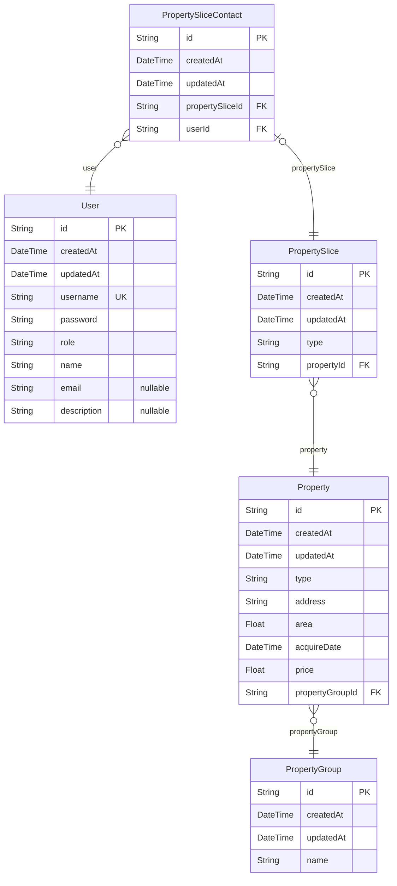

# Prisma Markdown

> Generated by [`prisma-markdown`](https://github.com/samchon/prisma-markdown)

-   [default](#default)

## default

### `User`

**Properties**

-   `id`:
-   `createdAt`:
-   `updatedAt`:
-   `username`: 使用者名稱
-   `password`: 使用者密碼
-   `role`: Admin (作業人員) / User (租客)
-   `name`: 真實姓名或法人名稱
-   `email`: Email通知消息時使用
-   `description`: 其他備註

### `PropertyGroup`

資產群組

**Properties**

-   `id`:
-   `createdAt`:
-   `updatedAt`:
-   `name`: 資產群組名稱。例: 葉財記大樓

### `Property`

資產

**Properties**

-   `id`:
-   `createdAt`:
-   `updatedAt`:
-   `type`: 建物類別: Land / Building
-   `address`: 建物地址。例: 台北市大安區通化段五小段492地號
-   `area`: 建物面積(平方公尺)。例: 608.00
-   `acquireDate`: 取得年月日
-   `price`: 帳面金額
-   `propertyGroupId`: 屬於哪個資產群組

### `PropertySlice`

資產切分。只有資產切分才可與用戶訂立合約

**Properties**

-   `id`:
-   `createdAt`:
-   `updatedAt`:
-   `type`: 建物類別，與父層相同: Land / Building
-   `propertyId`: 屬於哪個資產

### `PropertySliceContact`

資產出租合約

**Properties**

-   `id`:
-   `createdAt`:
-   `updatedAt`:
-   `propertySliceId`: 哪個資產切分
-   `userId`: 屬於哪個用戶
