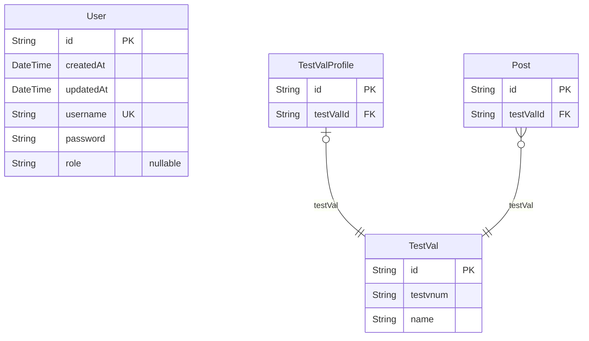

# Prisma Markdown
> Generated by [`prisma-markdown`](https://github.com/samchon/prisma-markdown)

- [default](#default)

## default

### `User`

**Properties**
  - `id`: 
  - `createdAt`: 
  - `updatedAt`: 
  - `username`: 
  - `password`: 
  - `role`: 

### `TestVal`

**Properties**
  - `id`: 
  - `testvnum`: 
  - `name`: 

### `TestValProfile`

**Properties**
  - `id`: 
  - `testValId`: 

### `Post`

**Properties**
  - `id`: 
  - `testValId`: 